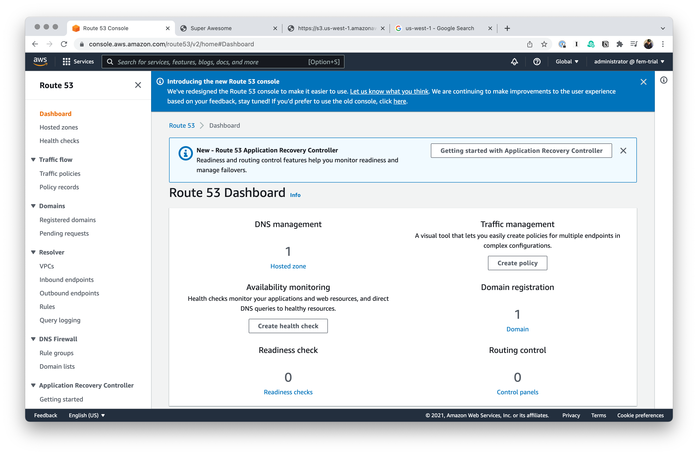
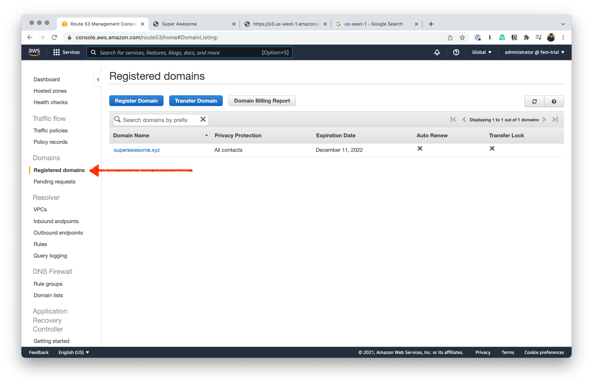
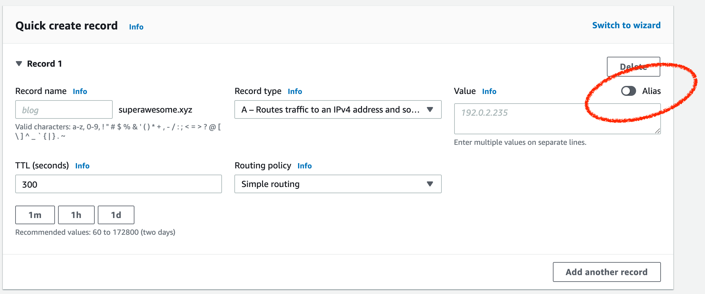

# Route 53

Let's head over to the landing page for Route 53.

We'll click on **Registered domains** and check on our domain.

You might see this error. If you do, then you just need to go and verify your email address.

- Click on the **Manage DNS** button.
- Select your domain and then click **View details**
- Click on **Create record**
- Find the very small **Alias** toggle and flip it on.
- With the new **Route traffic to** dropdown that just appeared:
  - Select **Alias to S3 website endpoint**
  - Select whatever region your S3 bucket is in.
  - Select the bucket with your website in it.

%%**TODO**: Maybe get a domain name somewhere else and point it at Route 53 as an example?%%

%%**TODO**: Try it out with a bucket that does not have the same name as the domain.%%

## Registering an SSL certificate

If your domain is registed with AWS, this is a very easy and a very free process. To get started, head over to the [AWS Certificate Manager](https://us-west-1.console.aws.amazon.com/acm/home).

- Click on **Request a certificate**.
- Keep the radio button set to **Request a public certificate**.
- Type in all of the domains you want covered by the certificate.
- Don't ignore the red banner along the top telling you that you need to take further action.
- Hit the button that says **Create records in Route 53**.
- Hit **Create records**.
